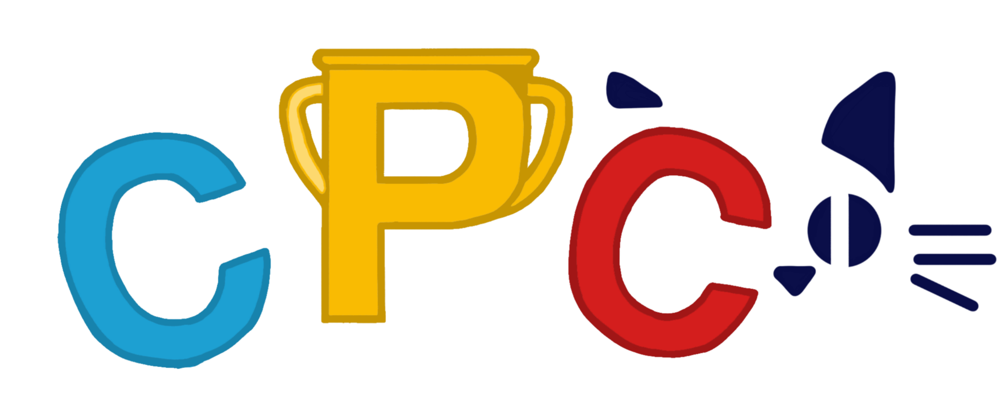

# CPC UAEH Solutions

Repositorio de soluciones para problemas de programación competitiva de CPC Judge.



## Acerca del proyecto

Este repositorio reúne soluciones a problemas disponibles en CPC Judge, desarrolladas a lo largo de concursos, campamentos, entrenamientos, sesiones de práctica, participaciones virtuales y actividades de upsolving.

Su objetivo es conservar un registro organizado de problemas resueltos, apoyar el aprendizaje de nuevos integrantes del Club de Programación Competitiva (CPC) de la UAEH y preservar material histórico generado durante las distintas actividades del club.

## CPC Judge

CPC Judge es la plataforma utilizada por el Club de Programación Competitiva de la UAEH para la gestión de problemas, concursos y actividades de entrenamiento.

🔗 https://cpcjudge.com/

## Propósitos del repositorio

* Mantener un archivo histórico de soluciones.
* Facilitar la consulta de implementaciones previas.
* Servir como material de referencia para nuevos integrantes.
* Documentar la participación en concursos y actividades de entrenamiento.
* Centralizar soluciones desarrolladas en distintos periodos y generaciones del club.

## Organización

Las soluciones se encuentran agrupadas según el evento, concurso, campamento o conjunto de problemas al que pertenecen.

```text
Campamento de Primavera 2025/
├── A.cpp
├── B.cpp
└── C.cpp

Campamento de Primavera 2026/
├── A.cpp
├── B.cpp
└── C.cpp

```

La estructura puede evolucionar conforme se incorporen nuevos eventos o actividades.

## Alcance

Este repositorio contiene únicamente código fuente y soluciones de problemas.

No pretende funcionar como editorial oficial, colección de tutoriales ni documentación académica. Su propósito principal es conservar implementaciones utilizadas para resolver problemas dentro del ecosistema de CPC Judge.

## Autor

Desarrollado y mantenido por:

* @kaarlarax

## Licencia

Este repositorio tiene fines educativos y de consulta académica.

